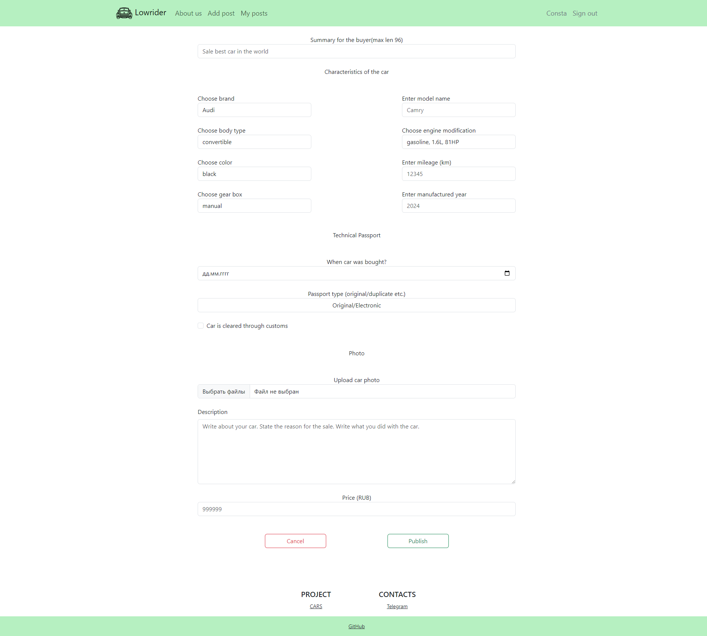

# Project "cars"

About project
------------
This is a car-buying website that lets you pick the car you want from its selection of vehicles.
There are ads in website, that contains an information about car:
- description
- car brand
- car body type
- photos
- The ad has the status - sold or not
You can create, update, delete your ads.

Tech stack.
--------------
- Java 17
- PostgreSQL 14
- Spring Boot 2
- Hibernate 5
- Thymeleaf
- Bootstrap
- Liquibase
- Sql2o
- Lombok
- Querydsl

Environment requirements.
------------------------
1. Java 17
2. Maven 3.8
3. PostgreSQL 14

Launching the project.
---------------------
1. Recommended Chrome based browser.
2. Install PostgreSQL: login - postgres, password - password;
3. Create database;
> CREATE DATABASE cars;
4. Download the source code of Bootstrap 5 and unzip the file
   https://github.com/twbs/bootstrap/archive/v5.3.3.zip
---
5. Сopy the folder to the specified directory
- src/main/resources/static/<bootstrap folder>
---
4. Build the project and run the Spring Boot application
> mvn clean package spring-boot:run

Application Interaction.
------------------------
------------------------
Main
----

- with advanced search

Registration
--------

Login
--------

Get detail info
----------

Add post
---------

Userposts
----------

Contacts.
--------
- Telegram - https://t.me/ConstaMezenin.